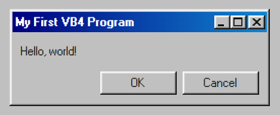
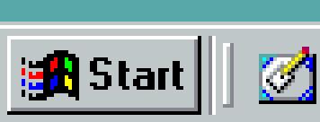
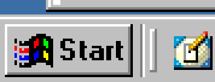
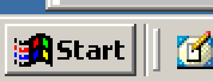
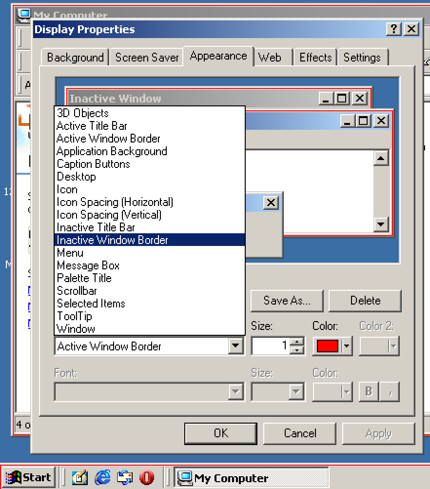
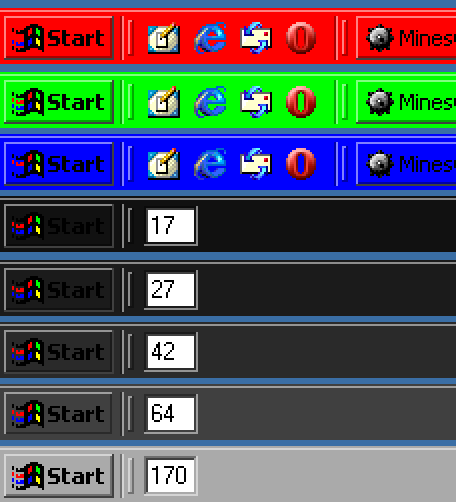

# w2k.css

## Pixel Perfect Look, an analysis on Windows 2000

Using [98.css](https://jdan.github.io/98.css/) comes very close to imitate the
classic Windows look in the browser but it needs some minor adjustments to
actually match it.

Lets take a look on how Windows 2000 actually looks like. For this I've
installed a
[Windows NT 2000 iso from winworldpc](https://winworldpc.com/product/windows-nt-2000/final)
on VirtualBox along with the
[VBoxGuestAdditions.iso](https://www.virtualbox.org/manual/ch04.html) to have
proper video support

> ...and automatic view resize, file sharing etc. but we don't need those,
> `True Color (32 bit)` video output is a must though, on my Windows 98 VM,
> where VBoxGuestAdditions are not available, I only have 16 bit output and the
> colors appear off, for example `rgb(192, 192, 192)` looks like
> `rgb(192, 199, 200)`

### 3D Objects

The first thing that you can notice is that 98.css defines every 3D objects
(That's what Windows calls windows, buttons that appear raised) with `2px` wide
on every edge, meanwhile on windows, buttons and panels are only `1px` thick on
the left and top side. And when pressed, the buttons become `inset` and the
sides swap.

Actual windows and input fields are correct as they have `2px` edges everywhere.

### The Start Button

| Theme        | Start Button                                                                          | 3D Object Color                                                            |
| ------------ | ------------------------------------------------------------------------------------- | -------------------------------------------------------------------------- |
| w98 Standard |  | `rgb(192, 192, 192)` (appears as `rgb(192, 199, 200)` due to 16bit colors) |
| w2k Classic  |    | `rgb(192, 192, 192)`                                                       |
| w2k Standard |  | `rgb(212, 208, 201)`                                                       |

> Screenshots are from VirtualBox VMs, scaled by 4. The panel color in the `w98`
> screenshot is actually `rgb(192, 199, 200)` but it's due to only using 16-bit
> video output. In the `Display Properties > Appearance > Items > 3D Objects`
> color selector you can verify that it's supposed to be `rgb(192, 192, 192)`

### Borders

Again, playing with the `Display Properties`, if I recolor
`Active Window Border` and `Inactive Window Border`, we can see that the border
is inside the edge of a 3D Object. It was also an interesting fact that the task
bar also counts as a window!

### Colors

98.css has only one goal and that's achieving the Win98 classic look. But it's
not themable. The source stylesheet does have css variables but the distributed
one doesn't seem to have them. But even so, it defines colors separately. For
the [3D Objects](#3d-objects)' color to be changed like in Windows, you need to
derive the edge's colors from the color defined for 3D objects.

#### How does Windows do it?

I've compiled a small list on how the taskbar looks like with different
grayscale colors, and with pure red, green and blue.

Starting from the bottom, I've set the color value of `3D Objects` to the
darker, bottom/right edge of the start button. With this we get a sequence of
numbers that are always 2/3s of the previous value, rounded down.

An interesting thing here is that the shadow color, which is the
bottom-rightmost edges of the button, has a fixed color, is always
`rgb(64, 64, 64)`! But only in the standard theme! In the classic theme and in
Windowd 98, this shadow color is pure black!

### Fonts

Windows 98 and Windows 2000's classic scheme both uses `Microsoft Sans Serif`
(Which is provided by `98.css`) as the default font, but Windows 2000's standard
scheme uses `Tahoma`. For this font I've found a good, pixelated recreation:
[fs Tahoma 8px by ETHproductions](https://fontstruct.com/fontstructions/show/735108)
