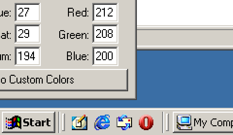
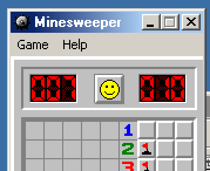
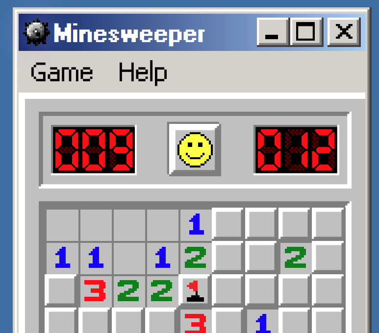

# w2k.css

## Pixel Perfect Look, an analysis on Windows 2000

Using [98.css](https://jdan.github.io/98.css/) comes very close to imitate the
classic Windows look in the browser but it needs some minor adjustments to
actually match it.

Lets take a look on how Windows 2000 actually looks like. For this I've
installed a
[Windows NT 2000 iso from winworldpc](https://winworldpc.com/product/windows-nt-2000/final)
on VirtualBox along with the
[VBoxGuestAdditions.iso](https://www.virtualbox.org/manual/ch04.html) to have
proper video support

> ...and automatic view resize, file sharing etc. but we don't need those,
> `True Color (32 bit)` video output is a must though, on my Windows 98 VM,
> where VBoxGuestAdditions are not available, I only have 16 bit output and the
> colors appear off, for example `rgb(192, 192, 192)` looks like
> `rgb(192, 199, 200)`

### 3D Objects


The first thing that you can notice is that 98.css defines every 3D objects
(That's what Windows calls windows, buttons that appear raised) with `2px` wide
on every edge, meanwhile on windows, buttons and panels are only `1px` thick on
the left and top side. And when pressed, the buttons become `inset` and the
sides swap.

Actual windows and input fields are correct as they have `2px` edges everywhere.

### The Start Button

| Theme        | Start Button                                                                          | 3D Object Color                                                            |
| ------------ | ------------------------------------------------------------------------------------- | -------------------------------------------------------------------------- |
| w98 Standard |  | `rgb(192, 192, 192)` (appears as `rgb(192, 199, 200)` due to 16bit colors) |
| w2k Classic  |    | `rgb(192, 192, 192)`                                                       |
| w2k Standard |  | `rgb(212, 208, 201)`                                                       |

> Screenshots are from VirtualBox VMs, scaled by 4. The panel color in the `w98`
> screenshot is actually `rgb(192, 199, 200)` but it's due to only using 16-bit
> video output. In the `Display Properties > Appearance > Items > 3D Objects`
> color selector you can verify that it's supposed to be `rgb(192, 192, 192)`

### Borders

Again, playing with the `Display Properties`, if I recolor
`Active Window Border` and `Inactive Window Border`, we can see that the border
is inside the edge of a 3D Object. It was also an interesting fact that the task
bar also counts as a window!


### Colors

98.css has only one goal and that's achieving the Win98 classic look. But it's
not themable. The source stylesheet does have css variables but the distributed
one doesn't seem to have them. But even so, it defines colors separately. For
the [3D Objects](#3d-objects)' color to be changed like in Windows, you need to
derive the edge's colors from the color defined for 3D objects.

#### How does Windows do it?

I've compiled a small list on how the taskbar looks like with different
grayscale colors, and with pure red, green and blue.


Starting from the bottom, I've set the color value of `3D Objects` to the
darker, bottom/right edge of the start button. With this we get a sequence of
numbers that are always 2/3s of the previous value, rounded down.

An interesting thing here is that the shadow color, which is the
bottom-rightmost edges of the button, has a fixed color, is always
`rgb(64, 64, 64)`! But only in the standard theme! In the classic theme and in
Windowd 98, this shadow color is pure black!


#### Not always

When using the standard theme, the `3D Object` color is `rgb(212, 208, 201)`,
but the darker edge color is `rgb(123, 123, 123)`, and not `rgb(151, 142, 123)`!



Except if you make a custom scheme out of it! If you change the color a little,
hit Apply, then change it back, 3D edges will also be colored!


Hard to see the difference? Lets zoom in:


> Left: Standard, unmodified. Right: Custom replica of Standard. This is still
> all within the Windows NT 2000 VM.

To accomodate for this, I added an intermediate variable for the shade
calculations called `shade-source`, and a `.custom-scheme` class selector. When
present, the `shade-source` is the actual `3d-objects-color`, but if not, it's
the default `3D Objects` color of the classic theme/Windows 98.

> For easier lightness adjustments for the different shades of this color, the
> variables are defined as components of a `hsl` color.

```scss
.w2k {
  &.custom-scheme {
    --win-3d-objects-shade-source-h: var(--win-3d-objects-color-h);
    --win-3d-objects-shade-source-s: var(--win-3d-objects-color-s);
    --win-3d-objects-shade-source-l: var(--win-3d-objects-color-l);
  }

  &:not(.custom-scheme) {
    // rgb(192 192 192) #C0C0C0
    --win-3d-objects-shade-source-h: 160;
    --win-3d-objects-shade-source-s: 0%;
    --win-3d-objects-shade-source-l: 75.33%;
  }
}
```

### Fonts

Windows 98 and Windows 2000's classic scheme both uses `Microsoft Sans Serif`
(Which is provided by `98.css`) as the default font, but Windows 2000's standard
scheme uses `Tahoma`. For this font I've found a good, pixelated recreation:
[fs Tahoma 8px by ETHproductions](https://fontstruct.com/fontstructions/show/735108)

### minesweeper

#### Why not borders with style inset/outset?

While they are similar, you can't control the difference between the shadowy and
lit parts of such a border. And the luminance difference in the Windows UI is
much larger. If I set the border color to the 1 lighter version of the 3D Object
color, the darker side won't match. I could set the shadowed sides colors to a
darker color, but the way the browser calculates how dark it should ba based on
a base color is, again, different. (Using the lighter shade of the base shade as
the base color, shadow color that is lighter then supposed to be. using the base
shade itself results in a darker shadow color.)

Instead of figuring out the ratio, I just continued to use box shadows, just
like in 98.css. This too can't be pixel perfect either.

This is how it looks like in Windows 2000:


And this is my replica: 

Notice how the two lit and shadowy edges meet in the corner, they merge into
their middle color which should be the same color as the original shade base
color. Unfortunately I couldn't replicate this with the `box-shadow` hack. I
tried using transparent black/white to replicate the target color but because -
for the pixelated look - I use stacked shadows, the transparent shadows would
add up. That, and if the shadow is transparent it can't be pure white.
