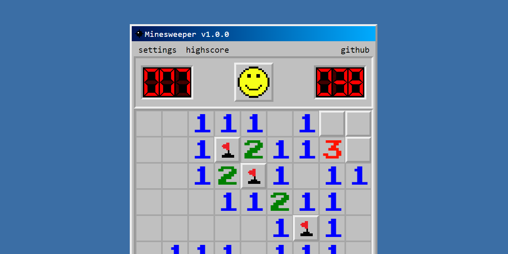
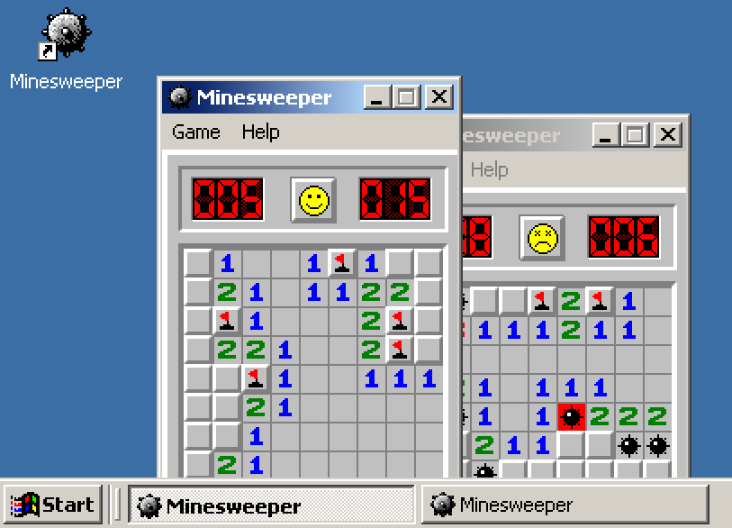

# [Minesweeper](https://alexaegis.github.io/minesweeper/)

<!-- markdownlint-disable MD013 -->

<!-- markdownlint-enable MD013 -->

The classic Win98 Minesweeper game recreated for the web using reactive
technologies such as Svelte and RxJS. With some additional features of a Windows
2000 desktop interface like window management, and a taskbar together with a
start menu.

> Click on the image to try it out on github pages!

[Also available @ Vercel](https://minesweeper-kit.vercel.app/)

## Comparison

Here's a screencapture from a Windows NT 2000 Virtual Machine:

### Differences

> I either can't fix these, or they would make no sense to fix. There are of
> course many more differences, these are the ones I noticed and thought worth
> mentioning.

- Font used does not contain actual bold versions of Tahoma at 8px
- The edges of the tiles and panels within Minesweeper have some
  [`3D Object`](./docs/w2k.blog.md#3d-objects) colored pixels where the edges
  meet. This cannot be replicated with the `box-shadow` trick, and regular
  `inset/outset` css borders have a sharp edge.
- The numbers are not pixelated. I've spent a lot of time making those numbers
  with `clip-path`'s so they will stay. And I think I managed to capture the
  shape of the original pretty well.
- Some pixel are not exactly pixel shaped, that's thanks to browser rendering,
  can't do anything about that.
- The timer for Minesweeper in the original starts at `1`, immediately as you
  start the game. I believe this is not correct so my timer switches to `1` only
  after a second after starting the game.
  > My initial implementation actually did make the same mistake, and started
  > from 1 immediately!
- The maximum size of a playfield in the original is `30 by 24`, not much larger
  than the `Expert` preset. I raised this to `50 by 50`.
- Pressing `Cancel` in the custom game window resets the game board in the
  original. I'm not going to do that.

## Features

- Taskbar
  - Start button, animated Start Menu
  - Buttons for open programs
  - A clock
- Window Management
  - Movable
  - Minimizable (Animated!)
  - Resizable
  - Modals
  - Dropdowns
- Minesweeper Game
  - Original presets
  - Custom games
  - Highscores
  - Cheating (Recorded to the highscore!)
  - Unlocking the scheme (The original used W98 colors regardless of your
    scheme)

## Known bugs

- Shortcuts do not work.

## Planned features

- Cheese Terminator
- Basic scheme editor
- A tetris game would be cool

## Styles

[98.css](https://jdan.github.io/98.css/#intro) with some tweaks.

## Other art

Pixelart was done by me using [Pixilart](https://www.pixilart.com/alexaegis)
referencing imagery from Windows Virtual Machines.
