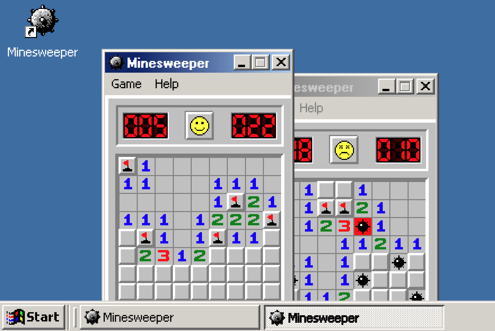

# [Minesweeper](https://alexaegis.github.io/svelte-minesweeper/)

[](https://github.com/AlexAegis/svelte-minesweeper/actions?query=workflow%3ALint)

> Built with Svelte

The classic Win98 Minesweeper game recreated for the web using reactive
technologies such as Svelte and RxJS.

[](https://alexaegis.github.io/svelte-minesweeper/)

> Click on the image to try out!

## Development

```sh
npm install
npm start
```
